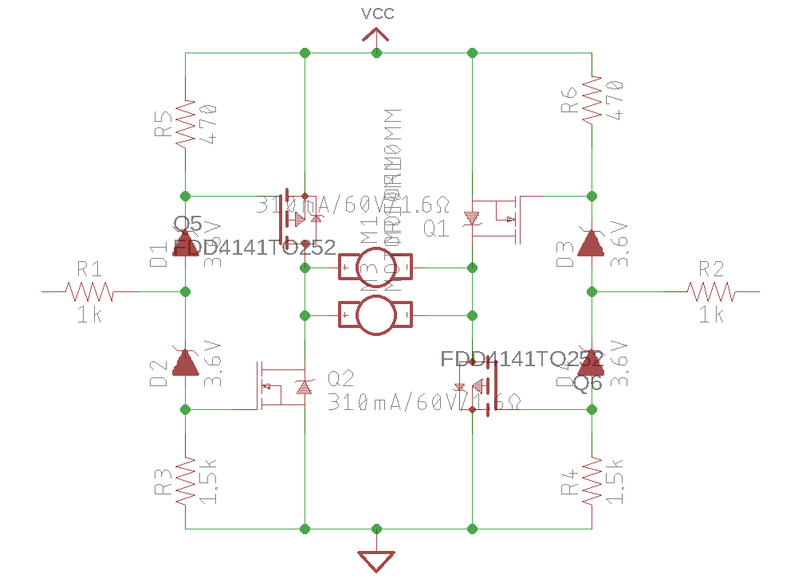

Our Goal was to design an electrically robust system. 

How? 
1) Researching, prototyping and testing all circuits before integrating them into our system.
2) Minimizing the number of electrical components and substituting with software solutions where possible.
3) Applying safety measures such as
  i) adding decoupling capacitors in the right places
  ii) using shielded wire to minimize noise inteference
  iii) making sure grounds are connected while avoiding ground loops
  iv) applying circuit buffers where necessary.

For circuits which had a high likelehood of failure we made multiple sets of that circuit and designed our main PCB for easy exchange.

Sensors:
QRD 124 phototransistor for detecting 

Microprocessors: We used a TINAH board (ENPH 253 modified arduino) and a separate arduino. The TINAH was the main processing unit, controlling the drive train, 1 RCservo, and processing the Photo

Voltage regulators were required for powering some of our actuators. We compared Linear vs. Switching voltage regulators
https://www.renesas.com/us/en/products/power-management/linear-vs-switching-regulators.html
From our assessment, cost, size and noise reduction were the most critical factors which led to us choosing Linear regulators.

Through working on this we learnt
1) Attention to detail so as to minimize error in order to owrk within the time constraints.
2) Time management.
2) Design and prototyping.
3) Debugging and finding the root cause of a problem.
4) Approaching problems from a 1st principles view point to avoid technical debt later on.
5) Grit in figuring things out after multiple attempts.

